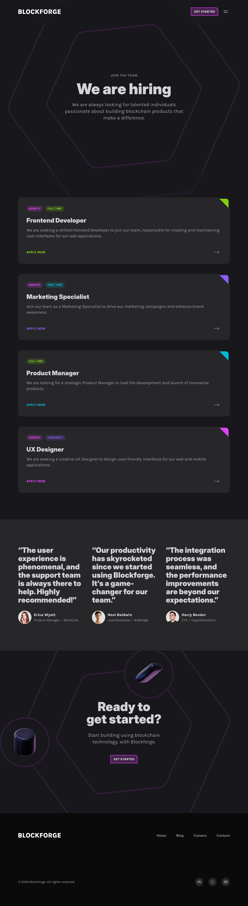

## Project Description

Blockforge is an innovative platform offering cutting-edge blockchain solutions for businesses and developers. This modern and dynamic website is built with Astro and React, focused on showcasing the capabilities and services of a blockchain platform. The design utilizes a dark color palette with fuchsia accents, creating a futuristic and technological aesthetic.



## Key Features

- Modern responsive design with dark mode
- Interactive sections with smooth animations
- Integrated blog with blockchain and technology articles
- Careers section for job opportunities
- React component integration for dynamic functionalities
- Smart contract deployment and management
- Real-time blockchain analytics dashboard
- Multi-wallet integration support
- Advanced security protocols
- API documentation and developer tools

## Technologies Used

- [Astro](https://astro.build/)
- [React](https://reactjs.org/)
- [Tailwind CSS](https://tailwindcss.com/)
- [TypeScript](https://www.typescriptlang.org/)
- [Web3.js](https://web3js.readthedocs.io/)
- [Ethers.js](https://docs.ethers.org/)
- [Hardhat](https://hardhat.org/)
- [OpenZeppelin](https://openzeppelin.com/)

## Project Structure

```
blockforge/
│
├── src/
│   ├── components/      # Reusable UI components
│   ├── content/         # Markdown content
│   │   ├── blog/        # Blog articles
│   │   └── positions/   # Job positions
│   ├── layouts/         # Page layouts
│   ├── pages/           # Route pages
│   ├── sections/        # Page sections
│   ├── styles/          # Global styles
│   └── utils/           # Helper functions
│
├── public/
│   └── assets/
│       ├── images/      # Static images
│       └── icons/       # UI icons
│
├── contracts/           # Smart contracts
├── scripts/            # Deployment scripts
├── test/              # Test files
├── astro.config.mjs
├── tailwind.config.mjs
├── hardhat.config.ts
├── tsconfig.json
└── package.json
```

## Installation and Usage

1. Clone the repository:

   ```bash
   git clone https://github.com/your-username/blockforge.git
   ```

2. Install dependencies:

   ```bash
   cd blockforge
   npm install
   ```

3. Set up environment variables:

   ```bash
   cp .env.example .env
   # Edit .env with your configuration
   ```

4. Start the development server:

   ```bash
   npm run dev
   ```

5. Open your browser and visit `http://localhost:3000`

## Main Sections

### Hero Section

The Hero section presents an impactful introduction to Blockforge with animations and geometric shapes.

```tsx
export const HeroSection = () => {
	return (
		<section className="py-24 md:py-52 overflow-x-clip">
			<div className="container">
				<p className="uppercase font-extrabold text-center text-zinc-500 tracking-wider">
					Introducing Blockforge
				</p>
				<h1 className="font-heading font-black text-5xl md:text-6xl lg:text-7xl text-center mt-4 max-w-3xl mx-auto">
					The Future of Blockchain is Here.
				</h1>
				<p className="text-center text-xl md:text-2xl mt-6 text-zinc-400 max-w-xl mx-auto">
					Blockforge is pioneering smart contract integrity with cutting-edge data solutions.
				</p>
			</div>
		</section>
	);
};
```

### Features

The features section showcases Blockforge's key capabilities using interactive cards.

```tsx
const FeaturesCardsSection = () => {
	return (
		<section className="py-24 overflow-clip md:-mt-28">
			<div className="container">
				<h2 className="font-heading font-black text-4xl md:text-5xl lg:text-6xl text-center">
					Discover the future of blockchain with Blockforge.
				</h2>
				<div className="mt-36 lg:mt-48 flex">{/* Feature cards code */}</div>
			</div>
		</section>
	);
};
```

### Blog

The blog features articles about blockchain, cryptocurrencies, and related technology.

Example blog article:

```markdown
---
title: "Blockchain Security: Protecting Digital Assets"
description: "Explore the key security features of blockchain technology and how it keeps digital assets safe from cyber threats."
pubDate: "2024-08-16"
category: Security
slug: "blockchain-security-protecting-digital-assets"
author:
  name: "John Smith"
  title: "Sr. Developer - BlockWorld"
  image: "/assets/images/john.jpg"
---
```

## Smart Contracts

Our smart contracts are built with security and efficiency in mind. They are audited by leading security firms and follow best practices in the industry.

### Contract Deployment

1. Configure your network in `hardhat.config.ts`
2. Run deployment script:
   ```bash
   npx hardhat run scripts/deploy.ts --network <network-name>
   ```

## Testing

Run the test suite:

```bash
npm run test
```

For coverage report:

```bash
npm run coverage
```

## Contributing

Contributions are welcome! Please follow these steps:

1. Fork the repository
2. Create your feature branch (`git checkout -b feature/AmazingFeature`)
3. Commit your changes (`git commit -m 'Add some AmazingFeature'`)
4. Push to the branch (`git push origin feature/AmazingFeature`)
5. Open a Pull Request

## Security

For security concerns, please email security@blockforge.com

## License

This project is licensed under the MIT License - see the `LICENSE` file for details.

## Support

- Documentation: [docs.blockforge.com](https://docs.blockforge.com)
- Discord: [Join our community](https://discord.gg/blockforge)
- Twitter: [@blockforge](https://twitter.com/blockforge)

---

Built with ❤️ by the Blockforge Team
