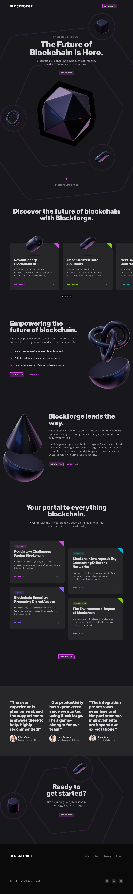

# 🚀 Blockforge - Dark SaaS Blockchain Site

Una plataforma web moderna y dinámica construida con Astro y React, enfocada en mostrar las capacidades y servicios de una plataforma blockchain de vanguardia. El diseño utiliza una paleta de colores oscura con acentos fucsia, creando una estética futurista y tecnológica.



## ✨ Características Principales

- **Diseño Responsivo Moderno**: Interfaz completamente adaptable con tema oscuro elegante
- **Animaciones Interactivas**: Secciones dinámicas con animaciones fluidas usando Framer Motion
- **Blog Integrado**: 10+ artículos sobre blockchain, DeFi, NFTs y tecnologías emergentes
- **Sección de Carreras**: Portal de empleos con 4+ posiciones disponibles
- **Componentes React Dinámicos**: Integración perfecta de componentes interactivos
- **Carrusel de Características**: Presentación automática de servicios con navegación manual
- **Testimonios**: Sección de reseñas y testimonios de clientes
- **Call-to-Action Optimizado**: Secciones de conversión estratégicamente ubicadas

## 🛠️ Stack Tecnológico

- **Framework**: [Astro 5.12.9](https://astro.build/) - Generador de sitios estáticos moderno
- **Frontend**: [React 19.1.1](https://reactjs.org/) - Biblioteca de componentes interactivos
- **Estilos**: [Tailwind CSS 4.1.11](https://tailwindcss.com/) - Framework CSS utility-first
- **Animaciones**: [Framer Motion 11.18.2](https://www.framer.com/motion/) - Biblioteca de animaciones
- **Lenguaje**: [TypeScript 5.9.2](https://www.typescriptlang.org/) - JavaScript tipado
- **Herramientas**: Prettier, Tailwind Merge, @tailwindcss/typography

## 📁 Estructura del Proyecto

```
dark-saas-blockchain-site/
│
├── src/
│   ├── components/          # Componentes UI reutilizables
│   │   ├── Card.tsx         # Componente de tarjeta base
│   │   ├── Circle.tsx       # Elemento circular animado
│   │   ├── CutCornerButton.tsx # Botón con esquinas cortadas
│   │   ├── Hexagon.tsx      # Forma hexagonal
│   │   ├── LatestPosts.tsx  # Lista de posts recientes
│   │   ├── Tag.tsx          # Etiquetas de categorías
│   │   └── TextButton.tsx   # Botón de texto
│   │
│   ├── content/             # Contenido en Markdown
│   │   ├── blog/            # 10 artículos de blog
│   │   └── positions/       # 4 posiciones de trabajo
│   │
│   ├── layouts/
│   │   └── Default.astro    # Layout principal
│   │
│   ├── pages/
│   │   ├── blog/            # Páginas del blog
│   │   └── index.astro      # Página principal
│   │
│   ├── sections/            # Secciones de página
│   │   ├── CallToAction.tsx # Llamada a la acción
│   │   ├── FeaturesCards.tsx # Carrusel de características
│   │   ├── FeaturesGrid.tsx # Grid de características
│   │   ├── Footer.tsx       # Pie de página
│   │   ├── Header.tsx       # Encabezado
│   │   ├── Hero.tsx         # Sección hero
│   │   └── Testimonials.tsx # Testimonios
│   │
│   ├── utils/
│   │   └── postUtils.ts     # Utilidades para posts
│   │
│   ├── content.config.ts    # Configuración de contenido
│   ├── env.d.ts            # Tipos de entorno
│   └── global.css          # Estilos globales
│
├── public/
│   └── assets/             # Recursos estáticos
│
├── resources/              # Imágenes de diseño
├── .astro/                # Cache de Astro
├── astro.config.mjs       # Configuración de Astro
├── tsconfig.json          # Configuración de TypeScript
└── package.json           # Dependencias del proyecto
```

## 🚀 Instalación y Uso

1. **Clona el repositorio**:

   ```bash
   git clone https://github.com/tu-usuario/dark-saas-blockchain-site.git
   cd dark-saas-blockchain-site
   ```

2. **Instala las dependencias**:

   ```bash
   # Usando npm
   npm install

   # O usando bun (recomendado para mejor rendimiento)
   bun install
   ```

3. **Inicia el servidor de desarrollo**:

   ```bash
   npm run dev
   # o
   bun run dev
   ```

4. **Abre tu navegador** y visita `http://localhost:4321`

### 📋 Scripts Disponibles

- `npm run dev` - Inicia el servidor de desarrollo
- `npm run build` - Construye el proyecto para producción
- `npm run preview` - Previsualiza la build de producción
- `npm run check` - Verifica el código con Astro Check

## 🎯 Secciones Principales

### 🦸‍♂️ Hero Section

Presentación impactante de Blockforge con animaciones y formas geométricas, incluyendo elementos circulares animados con Framer Motion.

### 🎴 Features Cards

Carrusel interactivo que muestra las 4 características principales:

- **Revolutionary Blockchain API** - Integración y gestión de datos blockchain
- **Decentralized Data Solutions** - Soluciones de datos descentralizadas
- **Next-Gen Smart Contracts** - Contratos inteligentes de próxima generación
- **Seamless Blockchain Integration** - Integración perfecta de blockchain

El carrusel incluye:

- Rotación automática cada 3 segundos
- Navegación manual con indicadores
- Animaciones hover en las tarjetas
- Efectos de sombra y elevación

### 📝 Blog

10 artículos especializados sobre blockchain y tecnologías emergentes:

- Blockchain Security: Protecting Digital Assets
- Smart Contracts: Future of Legal Agreements
- How NFTs are Changing Digital Ownership
- Blockchain Role in Decentralized Finance (DeFi)
- Tokenomics: Understanding Blockchain Economics
- Blockchain Scalability: Challenges and Solutions
- Environmental Impact of Blockchain
- Regulatory Challenges Facing Blockchain
- Blockchain Interoperability: Connecting Networks
- Blockchain in Healthcare: New Frontier

### 💼 Careers

Portal de empleos con 4 posiciones disponibles:

- **Frontend Developer** - Desarrollo de interfaces modernas
- **UX Designer** - Diseño de experiencias de usuario
- **Product Manager** - Gestión de productos blockchain
- **Marketing Specialist** - Especialista en marketing digital

### 💬 Testimonials

Sección de testimonios y reseñas de clientes para generar confianza y credibilidad.

## 🎨 Componentes Destacados

### Circle Component

Elemento circular animado con rotación continua usando Framer Motion:

```tsx
<Circle animate={true}>{/* Contenido del círculo */}</Circle>
```

### Card Component

Tarjeta base reutilizable con efectos hover y esquinas redondeadas.

### CutCornerButton

Botón personalizado con esquinas cortadas para un diseño futurista.

## 🔧 Configuración Técnica

### Astro Configuration

```javascript
export default defineConfig({
  integrations: [react()],
  output: "static",
  vite: {
    plugins: [tailwindcss()],
  },
});
```

### TypeScript Paths

El proyecto incluye alias de importación configurados:

- `@/*` → `src/*`
- `@components/*` → `src/components/*`
- `@layouts/*` → `src/layouts/*`
- `@sections/*` → `src/sections/*`
- `@utils/*` → `src/utils/*`

## 🚀 Deployment

Para desplegar el proyecto:

```bash
# Construir para producción
npm run build

# Previsualizar la build
npm run preview
```

El proyecto genera archivos estáticos optimizados en la carpeta `dist/`.

## 🤝 Contribuir

Las contribuciones son bienvenidas. Para contribuir:

1. Fork el repositorio
2. Crea una rama para tu feature (`git checkout -b feature/NuevaCaracteristica`)
3. Commit tus cambios (`git commit -m 'Añadir nueva característica'`)
4. Push a la rama (`git push origin feature/NuevaCaracteristica`)
5. Abre un Pull Request

## 📄 Licencia

Este proyecto está bajo la Licencia MIT - ver el archivo `LICENSE` para más detalles.

---

**Desarrollado con 💜 usando Astro + React + Tailwind CSS**
