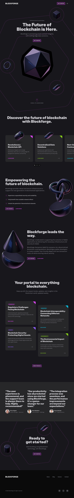

# Blockforge - Dark SaaS Blockchain Site

A modern, dynamic web platform built with Astro and React, showcasing blockchain platform capabilities. Dark palette with fuchsia accents creates a futuristic, tech-forward aesthetic.



## Features

- **Responsive Design**: Fully adaptive dark theme interface
- **Interactive Animations**: Dynamic sections with Framer Motion
- **Integrated Blog**: 10+ articles on blockchain, DeFi, NFTs, and emerging tech
- **Careers Portal**: 4+ job positions available
- **React Components**: Seamless interactive component integration
- **Feature Carousel**: Auto-rotating service showcase with manual navigation
- **Testimonials**: Client reviews and testimonials section
- **Optimized CTAs**: Strategically placed conversion sections

## Tech Stack

- **Framework**: [Astro 7.0.2](https://astro.build/) - Modern static site generator with Rust compiler
- **Frontend**: [React 19.2.0](https://reactjs.org/) - Interactive component library
- **Styling**: [Tailwind CSS 4.1.14](https://tailwindcss.com/) - Utility-first CSS framework
- **Animations**: [Framer Motion 11.18.2](https://www.framer.com/motion/) - Animation library
- **Language**: [TypeScript 5.9.3](https://www.typescriptlang.org/) - Typed JavaScript
- **Deployment**: [Netlify](https://www.netlify.com/) - CDN with edge caching
- **Tools**: Prettier, Tailwind Merge, @tailwindcss/typography

## Project Structure

```
dark-saas-blockchain-site/
├── src/
│   ├── components/          # Reusable UI components
│   ├── content/             # Markdown content (blog, positions)
│   ├── layouts/             # Astro layouts
│   ├── pages/               # Route pages
│   ├── sections/            # Page sections (Hero, Features, etc.)
│   ├── utils/               # Utility functions
│   └── global.css           # Global styles
├── public/
│   └── assets/              # Static assets
├── astro.config.mjs         # Astro configuration
├── tsconfig.json            # TypeScript configuration
└── package.json             # Dependencies
```

## Installation

1. **Clone the repository**:

   ```bash
   git clone https://github.com/tu-usuario/dark-saas-blockchain-site.git
   cd dark-saas-blockchain-site
   ```

2. **Install dependencies**:

   ```bash
   npm install
   # or
   bun install
   ```

3. **Start development server**:

   ```bash
   npm run dev
   ```

4. **Open browser** at `http://localhost:4321`

### Available Scripts

- `npm run dev` - Start development server
- `npm run build` - Production build
- `npm run preview` - Preview production build
- `npm run check` - Run Astro Check

## Key Sections

### Hero Section

Impactful Blockforge presentation with animated geometric shapes and Framer Motion animations.

### Feature Cards

Interactive carousel showcasing 4 main features:
- Revolutionary Blockchain API
- Decentralized Data Solutions
- Next-Gen Smart Contracts
- Seamless Blockchain Integration

Features auto-rotation every 3 seconds with manual navigation.

### Blog

10 specialized articles on blockchain and emerging technologies.

### Careers

Job portal with 4 available positions: Frontend Developer, UX Designer, Product Manager, Marketing Specialist.

### Testimonials

Client reviews and testimonials section for trust and credibility.

## Technical Configuration

### Astro Configuration

```javascript
import netlify from "@astrojs/netlify";
import { cacheNetlify } from "@astrojs/netlify/cache";

export default defineConfig({
  integrations: [react(), compress()],
  output: "static",
  adapter: netlify(),
  cache: { provider: cacheNetlify() },
  compressHTML: "jsx",
  vite: {
    build: {
      rollupOptions: {
        output: {
          manualChunks: {
            "framer-motion": ["framer-motion"],
            "react-vendor": ["react", "react-dom"],
          },
        },
      },
    },
  },
});
```

### TypeScript Paths

- `@/*` → `src/*`
- `@components/*` → `src/components/*`
- `@layouts/*` → `src/layouts/*`
- `@sections/*` → `src/sections/*`
- `@utils/*` → `src/utils/*`

### Performance Optimizations

- **Lazy Loading**: React components use `client:visible` directive for deferred hydration
- **Code Splitting**: Framer-motion and React vendors in separate chunks
- **Image Optimization**: WebP/AVIF formats with 85-94% size reduction
- **CDN Caching**: Netlify edge cache for faster responses
- **Rust Compiler**: Astro 7's Rust-based compiler for faster builds

## Deployment

```bash
npm run build    # Production build
npm run preview  # Preview build
```

Static files are generated in `dist/` directory.

## Contributing

1. Fork the repository
2. Create a feature branch (`git checkout -b feature/amazing-feature`)
3. Commit changes (`git commit -m 'Add amazing feature'`)
4. Push to branch (`git push origin feature/amazing-feature`)
5. Open a Pull Request

## License

This project is licensed under the MIT License - see the `LICENSE` file for details.

---

Built with Astro + React + Tailwind CSS
